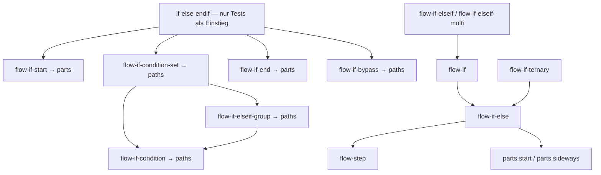

# Bestandsaufnahme: strang-Komponenten

Historische Bestandsaufnahme vor Archivierung. Ergebnis der anschließenden Prüfung: [Fähigkeitenvergleich und Archivierung](old-if-review.md). Die sieben Dateien liegen jetzt unter `strang/_old/`; Aufruferzeilen unten dokumentieren den untersuchten Stand vor der Verschiebung.

Stand: 18.09.2026, Ausgangscommit `1b0932f8`. Bestandsaufnahme und Vorschlag; keine Komponenten verschoben, gelöscht oder umbenannt.

## Ergebnis

- 25 Komponenten geprüft: 18 sinnvolle öffentliche Einstiege, 6 untergeordnete Bausteine der älteren IF-Kette und 1 älterer öffentlicher IF-Einstieg zur Ablösungsprüfung.
- Die sechs Bausteine sind fachlich 2 Parts und 4 Paths. Keiner ist klein genug, um als einzelnes Segment eingeordnet zu werden.
- Die aktuelle IF-Kette verwendet diese sechs alten Bausteine nicht. `if-else-endif` wird außerhalb von Tests nicht als Einstieg aufgerufen.
- `branch-end` und `rekey-target-left` werden von der Data-driven-Preview und weiteren Beispielen tatsächlich genutzt. Fehlende eigene Tabs sind kein Beleg für interne oder tote Komponenten.
- Öffentliche Komponenten dürfen andere öffentliche Komponenten verwenden. Wrapper wie `flow-start`, `flow-step`, `flow-if` und `flow-if-ternary` sind deshalb nicht automatisch interne Parts.

## Methode und Grenzen

Geprüft wurden alle 25 Blade-Dateien in `components/ui/tw-graph/strang`, ihre Props, Komposition und Ankeraufgaben sowie direkte Komponenten-Aufrufe in versionierten/nicht ignorierten Projektdateien. Blade-Kommentare (einschließlich Usage-Beispielen in Komponenten) wurden für Aufruferlisten ausgeblendet. Tests sind explizit getrennt: ein Testaufruf beweist keine produktive Verwendung. Die Fundstellen unten zählen Dateien, nicht Renderinstanzen.

Zusätzlich wurden Referenzen in PHP/JS und dynamische Komponentenstellen gesichtet. Für die alte IF-Kette wurde dabei kein weiterer produktiver Einstieg gefunden. Zusammengesetzte Laufzeitnamen, Datenbankinhalte, externe Paketnutzer und Aufrufe außerhalb dieses Repositories sind durch diese statische Analyse nicht ausgeschlossen. Textuelle Komponentenübersichten wie GraphFacts sind keine Render-Aufrufer. Dokumentationsdateien können ausgeblendet sein; eine Fundstelle beweist keinen eigenen sichtbaren Tab.

## Zuordnung aller Komponenten

| Komponente | Verantwortung | Vorgesehene Ebene | Maßnahme |
|---|---|---|---|
| [branch-end](../../resources/views/components/ui/tw-graph/strang/branch-end.blade.php) | Öffentlicher Abschluss eines Branch mit Anschlussauflösung, Endlabel, Cap und DEV-Mismatch-Anzeige. | strang | Behalten; separates Dokumentationsbeispiel ergänzen. Ein dünner Wrapper um segments.end ist hier semantisch sinnvoll. |
| [branch-left](../../resources/views/components/ui/tw-graph/strang/branch-left.blade.php) | Öffentliche Verzweigung links mit Extensions, Steps, Fortsetzungen und Rückführungen. | strang | Behalten. |
| [branch-right](../../resources/views/components/ui/tw-graph/strang/branch-right.blade.php) | Öffentliche Verzweigung rechts mit Extensions, Steps, Fortsetzungen und Rückführungen. | strang | Behalten. |
| [flow-if-bypass](../../resources/views/components/ui/tw-graph/strang/_old/flow-if-bypass.blade.php) | Verbindet zwei bestehende Anker über Stem → Arc → Bridge → Arc; keine eigene IF-Entscheidung. | paths | Nur bei Erhalt der alten IF-Kette nach paths.flow-if-bypass verschieben; sonst mit ihr entfernen. |
| [flow-if-condition-set](../../resources/views/components/ui/tw-graph/strang/_old/flow-if-condition-set.blade.php) | Koordiniert einen IF-Bedingungsweg und eine ELSEIF-Gruppe, vereinheitlicht Labelbreite und Ausgänge. | paths | Nur bei Erhalt der alten Kette nach paths.flow-if-condition-set. Enthält Orchestrierung mehrerer Teilpfade, kein einzelnes Segment. |
| [flow-if-condition](../../resources/views/components/ui/tw-graph/strang/_old/flow-if-condition.blade.php) | Einzelner geometrischer Bedingungszweig mit Condition-Label, Weiterführungs- und THEN-Ausgang. Kein vollständiger IF-Abschluss. | paths | Nur bei Erhalt der alten Kette nach paths.flow-if-condition; enthält mehrere Segmente und getrennte Anschlusswege. |
| [flow-if-else](../../resources/views/components/ui/tw-graph/strang/flow-if-else.blade.php) | Vollständige Entscheidung mit zwei Wegen, gemeinsamer Rückführung und offenen Anschlüssen für Nested-Blöcke. | strang | Behalten; öffentliche Komponente und zugleich gemeinsame Implementierung von IF/ternary. |
| [flow-if-elseif-group](../../resources/views/components/ui/tw-graph/strang/_old/flow-if-elseif-group.blade.php) | Iteriert ELSEIF-Einträge, verbindet deren einzelne Bedingungswege und exportiert die letzten Ausgänge. | paths | Nur bei Erhalt der alten Kette nach paths.flow-if-elseif-group; zusammengesetzter Teilpfad, keine öffentliche vollständige IF-Variante. |
| [flow-if-elseif-multi](../../resources/views/components/ui/tw-graph/strang/flow-if-elseif-multi.blade.php) | Öffentliche Variante mit mehreren ELSEIFs, unabhängigen Actions und anschließbaren Nested-Rückwegen. | strang | Behalten. |
| [flow-if-elseif](../../resources/views/components/ui/tw-graph/strang/flow-if-elseif.blade.php) | Öffentliche Variante mit einem ELSEIF und anschließendem Fallback. | strang | Behalten. Abgrenzung zu multi dokumentieren; gemeinsame interne Logik kann später geprüft werden. |
| [flow-if-end](../../resources/views/components/ui/tw-graph/strang/_old/flow-if-end.blade.php) | Abschließender Bridge-/Arc-Baustein mit ENDIF-Label und wählbarer Fortsetzung. | parts | Nur bei Erhalt der alten Kette nach parts.flow-if-end. Label-Modi und veröffentlichte Anker vor Zusammenlegung vergleichen. |
| [flow-if-start](../../resources/views/components/ui/tw-graph/strang/_old/flow-if-start.blade.php) | Einleitender Bogen-/Bridge-Baustein mit Inline- oder Node-Intro-Label; keine Entscheidung. | parts | Nur bei Erhalt der alten Kette nach parts.flow-if-start. Mit parts.sideways fachlich vergleichen, nicht blind austauschen. |
| [flow-if-ternary](../../resources/views/components/ui/tw-graph/strang/flow-if-ternary.blade.php) | Öffentliche ternäre Wertauswahl; delegiert Zeichnung an flow-if-else. | strang | Behalten: eigener semantischer Einstieg, keine Fehlplatzierung durch Delegation. |
| [flow-if](../../resources/views/components/ui/tw-graph/strang/flow-if.blade.php) | Öffentliches einfaches IF mit Action und Fallback-/Bypass-Weg; verwendet flow-if-else. | strang | Behalten, auch wenn andere IF-Stränge es intern wiederverwenden. |
| [flow-start](../../resources/views/components/ui/tw-graph/strang/flow-start.blade.php) | Öffentlicher Start eines Ablaufs, delegiert Geometrie an parts.start. | strang | Behalten. |
| [flow-step](../../resources/views/components/ui/tw-graph/strang/flow-step.blade.php) | Öffentliche Action mit Vor-/Nachlauf, Ankerregistrierung und getrennt steuerbarer Eingangsfarbe. | strang | Behalten; segments.step bleibt die untergeordnete Zeichenkomponente. |
| [flow-switch-case](../../resources/views/components/ui/tw-graph/strang/flow-switch-case.blade.php) | Öffentlicher SWITCH mit CASEs, gruppierten Einstiegen/Fusion, DEFAULT/Bypass, Nested-Ausgängen und Fall-through. | strang | Behalten. Separat prüfen, ob wiederverwendbare Fall-through-Verbindung künftig in paths gehört; aktuell ist sie inline, keine weitere Datei im Inventar. |
| [if-else-endif](../../resources/views/components/ui/tw-graph/strang/_old/if-else-endif.blade.php) | Vollständige ältere IF-/ELSEIF-/ENDIF-Komposition aus sechs untergeordneten Komponenten. | strang, falls weiterhin unterstützt | Ablösung prüfen. Nur Tests als äußere Aufrufer gefunden. Kein automatischer Löschentscheid: Gleichwertigkeit mit neuer IF-API und mögliche externe Nutzer sind nicht nachgewiesen. |
| [merge-left](../../resources/views/components/ui/tw-graph/strang/merge-left.blade.php) | Öffentliche Zusammenführung links mit Start, Extensions und Label-/Stem-Konfiguration. | strang | Behalten; paths.merge und paths.merge-extension sind bereits untergeordnet. |
| [merge-right](../../resources/views/components/ui/tw-graph/strang/merge-right.blade.php) | Öffentliche Zusammenführung rechts mit Start, Extensions und Label-/Stem-Konfiguration. | strang | Behalten. |
| [rekey-source-left](../../resources/views/components/ui/tw-graph/strang/rekey-source-left.blade.php) | Öffentliche Quellseite einer Rekey-Verbindung links, mit Merge-Pfad und komprimierter Fortsetzung. | strang | Behalten. |
| [rekey-source-right](../../resources/views/components/ui/tw-graph/strang/rekey-source-right.blade.php) | Öffentliche Quellseite einer Rekey-Verbindung rechts. | strang | Behalten; eigene Darstellung bisher insbesondere im Compressed-Beispiel. |
| [rekey-target-left](../../resources/views/components/ui/tw-graph/strang/rekey-target-left.blade.php) | Öffentliche Zielseite einer Rekey-Verbindung links, aus Branch-Pfad und Endsegment. | strang | Behalten; Dokumentationslücke schließen, nicht als unbenutzt einstufen. |
| [rekey-target-right](../../resources/views/components/ui/tw-graph/strang/rekey-target-right.blade.php) | Öffentliche Zielseite einer Rekey-Verbindung rechts. | strang | Behalten. |
| [trunk](../../resources/views/components/ui/tw-graph/strang/trunk.blade.php) | Öffentlicher Hauptstrang mit Start, N Stems und Abschluss, graphweiten Defaults und Ankerregistrierung. | strang | Behalten; Zeichnung delegiert an paths.trunk. |

## Die beiden IF-Ketten

## Wichtige Vertragsunterschiede vor einer Ablösung

Die alte API hat `introLabel`, `ifConditionLabel`, `elseifConditions`, `endLabel`, `thenContinuation` und getrennte linke/THEN-Anker. Die aktuelle API arbeitet mit `conditionLabel`, `ifStart`, `elseifs`, `ifEnd` sowie expliziten Nested-/Return-Anschlüssen. Das ist keine reine Dateiumbenennung und keine nachgewiesene 1:1-Ersetzung.

Die alte Kette normalisiert gemeinsame Labelbreiten in `flow-if-condition-set` und `flow-if-elseif-group`; `flow-if-start`/`flow-if-end` unterscheiden Inline-Label und Node-Label. Diese Regeln sind beim Übertragen auf die neue API ausdrücklich zu bewerten und zu testen, statt sie stillschweigend mitzunehmen.

Beim Verschieben wären neben Blade-Aufrufen auch `sourceType`, Default-IDs, Root-Identifier-Verhalten, veröffentlichte AnchorRegistry-Schlüssel und Tests zu prüfen. Öffentliche IDs sollten nicht versehentlich durch eine reine Ordneränderung wechseln. Veraltete Alias-Komponenten sind hier nicht vorgeschlagen.

## Empfohlene Reihenfolge

1. Entscheiden, ob die alte `if-else-endif`-API weiterhin fachlich benötigt wird. Ihre konkreten Tests aus `ManualPartsViewTest.php` gegen die aktuellen IF-Fähigkeiten abgleichen.
2. Falls vollständig abgelöst: die sieben Dateien gemeinsam entfernen und noch relevante Verhaltenstests auf die aktuelle API übertragen. Das benötigt einen gesonderten Nachweis; diese Bestandsaufnahme allein genügt nicht.
3. Falls weiterhin benötigt: öffentlichen Einstieg behalten, zwei Bausteine nach parts und vier nach paths verschieben; alle Aufrufer und Metadaten konsistent aktualisieren, ohne Alt-Aliase.
4. Die 18 aktiven öffentlichen Einstiege in strang belassen. Fehlende Demonstrationen für rekey-target-left und branch-end ergänzen.
5. Wiederverwendbare Inline-Geometrie aktueller Stränge separat betrachten (z. B. SWITCH-Fall-through). Nicht gleichzeitig Strukturänderung, Geometriekorrektur und API-Umbau vermischen.

## Fundstellen je Komponente

Links verweisen auf den untersuchten Quellstand; nach weiteren Änderungen können Zeilennummern wandern.

### branch-end

Quelle: [branch-end.blade.php](../../resources/views/components/ui/tw-graph/strang/branch-end.blade.php).

Direkte Unterkomponenten: `dev-box`, `segments.end`.

Aufrufer aus Komponenten: 0 Datei(en).

Aufrufer in idea-to-paper-Dokumentation: 1 Datei(en).

- [00-graph-final.blade.php](../../resources/views/pages/tw-graph/samples/documentation/idea-to-paper/00-graph-final.blade.php#L236): 236

Weitere Fundstellen (Preview, Samples oder Markdown-Beispiele): 5 Datei(en).

- [tw-graph-data-driven.blade.php](../../resources/views/livewire/raw-data/timeline-chains/graph-preview/tw-graph-data-driven.blade.php#L817): 817, 848
- [bug-lifecycle.blade.php](../../resources/views/pages/tw-graph/samples/bug-lifecycle.blade.php#L330): 330
- [order-lifecycle.blade.php](../../resources/views/pages/tw-graph/samples/order-lifecycle.blade.php#L475): 475
- [project-roadmap.blade.php](../../resources/views/pages/tw-graph/samples/project-roadmap.blade.php#L398): 398
- [translation-migration.blade.php](../../resources/views/pages/tw-graph/samples/translation-migration.blade.php#L310): 310

Direkte Testaufrufer: 0 Datei(en).

### branch-left

Quelle: [branch-left.blade.php](../../resources/views/components/ui/tw-graph/strang/branch-left.blade.php).

Direkte Unterkomponenten: `dev-box`, `paths.branch`, `paths.branch-extension`, `paths.branch-return`, `paths.branch-return-bridge`.

Aufrufer aus Komponenten: 0 Datei(en).

Aufrufer in idea-to-paper-Dokumentation: 5 Datei(en).

- [branch-continuation.blade.php](../../resources/views/pages/tw-graph/samples/documentation/idea-to-paper/strang/branch/branch-continuation.blade.php#L154): 154
- [branch-default.blade.php](../../resources/views/pages/tw-graph/samples/documentation/idea-to-paper/strang/branch/branch-default.blade.php#L159): 159
- [branch-final.blade.php](../../resources/views/pages/tw-graph/samples/documentation/idea-to-paper/strang/branch/branch-final.blade.php#L37): 37
- [branch-mismatch.blade.php](../../resources/views/pages/tw-graph/samples/documentation/idea-to-paper/strang/branch/branch-mismatch.blade.php#L154): 154
- [branch-offset.blade.php](../../resources/views/pages/tw-graph/samples/documentation/idea-to-paper/strang/branch/branch-offset.blade.php#L154): 154

Weitere Fundstellen (Preview, Samples oder Markdown-Beispiele): 5 Datei(en).

- [tw-graph-authoring.blade.php](../../resources/views/livewire/raw-data/timeline-chains/graph-preview/tw-graph-authoring.blade.php#L206): 206
- [tw-graph-data-driven.blade.php](../../resources/views/livewire/raw-data/timeline-chains/graph-preview/tw-graph-data-driven.blade.php#L830): 830
- [bug-lifecycle.blade.php](../../resources/views/pages/tw-graph/samples/bug-lifecycle.blade.php#L286): 286
- [order-lifecycle.blade.php](../../resources/views/pages/tw-graph/samples/order-lifecycle.blade.php#L347): 347
- [project-roadmap.blade.php](../../resources/views/pages/tw-graph/samples/project-roadmap.blade.php#L227): 227

Direkte Testaufrufer: 1 Datei(en).

- [StrangBranchViewTest.php](../../../../../tests/Unit/TwGraph/StrangBranchViewTest.php#L55): 55, 91, 168, 214, 360, 389, 443, 470, 522

### branch-right

Quelle: [branch-right.blade.php](../../resources/views/components/ui/tw-graph/strang/branch-right.blade.php).

Direkte Unterkomponenten: `dev-box`, `paths.branch`, `paths.branch-extension`, `paths.branch-return`, `paths.branch-return-bridge`.

Aufrufer aus Komponenten: 0 Datei(en).

Aufrufer in idea-to-paper-Dokumentation: 7 Datei(en).

- [00-graph-final.blade.php](../../resources/views/pages/tw-graph/samples/documentation/idea-to-paper/00-graph-final.blade.php#L192): 192
- [_graph-current-result.blade.php](../../resources/views/pages/tw-graph/samples/documentation/idea-to-paper/_graph-current-result.blade.php#L193): 193
- [branch-default.blade.php](../../resources/views/pages/tw-graph/samples/documentation/idea-to-paper/strang/branch/branch-default.blade.php#L175): 175
- [branch-final.blade.php](../../resources/views/pages/tw-graph/samples/documentation/idea-to-paper/strang/branch/branch-final.blade.php#L53): 53
- [branch-offset.blade.php](../../resources/views/pages/tw-graph/samples/documentation/idea-to-paper/strang/branch/branch-offset.blade.php#L169): 169
- [branch-return.blade.php](../../resources/views/pages/tw-graph/samples/documentation/idea-to-paper/strang/branch/branch-return.blade.php#L154): 154
- [branch-step.blade.php](../../resources/views/pages/tw-graph/samples/documentation/idea-to-paper/strang/branch/branch-step.blade.php#L154): 154

Weitere Fundstellen (Preview, Samples oder Markdown-Beispiele): 6 Datei(en).

- [tw-graph-authoring.blade.php](../../resources/views/livewire/raw-data/timeline-chains/graph-preview/tw-graph-authoring.blade.php#L283): 283
- [tw-graph-data-driven.blade.php](../../resources/views/livewire/raw-data/timeline-chains/graph-preview/tw-graph-data-driven.blade.php#L799): 799
- [bug-lifecycle.blade.php](../../resources/views/pages/tw-graph/samples/bug-lifecycle.blade.php#L243): 243
- [order-lifecycle.blade.php](../../resources/views/pages/tw-graph/samples/order-lifecycle.blade.php#L431): 431, 489
- [project-roadmap.blade.php](../../resources/views/pages/tw-graph/samples/project-roadmap.blade.php#L279): 279, 362
- [translation-migration.blade.php](../../resources/views/pages/tw-graph/samples/translation-migration.blade.php#L272): 272

Direkte Testaufrufer: 1 Datei(en).

- [StrangBranchViewTest.php](../../../../../tests/Unit/TwGraph/StrangBranchViewTest.php#L13): 13, 113, 135, 269, 324, 498

### flow-if-bypass

Quelle: [flow-if-bypass.blade.php](../../resources/views/components/ui/tw-graph/strang/_old/flow-if-bypass.blade.php).

Direkte Unterkomponenten: `segments.arc`, `segments.path`.

Aufrufer aus Komponenten: 1 Datei(en).

- [if-else-endif.blade.php](../../resources/views/components/ui/tw-graph/strang/_old/if-else-endif.blade.php#L142): 142

Aufrufer in idea-to-paper-Dokumentation: 0 Datei(en).

Weitere Fundstellen (Preview, Samples oder Markdown-Beispiele): 0 Datei(en).

Direkte Testaufrufer: 0 Datei(en).

### flow-if-condition-set

Quelle: [flow-if-condition-set.blade.php](../../resources/views/components/ui/tw-graph/strang/_old/flow-if-condition-set.blade.php).

Direkte Unterkomponenten: `strang.flow-if-condition`, `strang.flow-if-elseif-group`.

Aufrufer aus Komponenten: 1 Datei(en).

- [if-else-endif.blade.php](../../resources/views/components/ui/tw-graph/strang/_old/if-else-endif.blade.php#L98): 98

Aufrufer in idea-to-paper-Dokumentation: 0 Datei(en).

Weitere Fundstellen (Preview, Samples oder Markdown-Beispiele): 0 Datei(en).

Direkte Testaufrufer: 1 Datei(en).

- [ManualPartsViewTest.php](../../../../../tests/Unit/TwGraph/ManualPartsViewTest.php#L248): 248, 297, 338, 346, 354

### flow-if-condition

Quelle: [flow-if-condition.blade.php](../../resources/views/components/ui/tw-graph/strang/_old/flow-if-condition.blade.php).

Direkte Unterkomponenten: `segments.arc`, `segments.label-bridge`, `segments.path`.

Aufrufer aus Komponenten: 2 Datei(en).

- [flow-if-condition-set.blade.php](../../resources/views/components/ui/tw-graph/strang/_old/flow-if-condition-set.blade.php#L94): 94
- [flow-if-elseif-group.blade.php](../../resources/views/components/ui/tw-graph/strang/_old/flow-if-elseif-group.blade.php#L97): 97

Aufrufer in idea-to-paper-Dokumentation: 0 Datei(en).

Weitere Fundstellen (Preview, Samples oder Markdown-Beispiele): 0 Datei(en).

Direkte Testaufrufer: 0 Datei(en).

### flow-if-else

Quelle: [flow-if-else.blade.php](../../resources/views/components/ui/tw-graph/strang/flow-if-else.blade.php).

Direkte Unterkomponenten: `parts.sideways`, `parts.start`, `strang.flow-step`.

Aufrufer aus Komponenten: 2 Datei(en).

- [flow-if-ternary.blade.php](../../resources/views/components/ui/tw-graph/strang/flow-if-ternary.blade.php#L53): 53
- [flow-if.blade.php](../../resources/views/components/ui/tw-graph/strang/flow-if.blade.php#L54): 54

Aufrufer in idea-to-paper-Dokumentation: 4 Datei(en).

- [_graph-flow-diagram.blade.php](../../resources/views/pages/tw-graph/samples/documentation/idea-to-paper/_graph-flow-diagram.blade.php#L66): 66
- [flow-branch-steps.blade.php](../../resources/views/pages/tw-graph/samples/documentation/idea-to-paper/flow/flow-branch-steps.blade.php#L399): 399
- [flow-decision.blade.php](../../resources/views/pages/tw-graph/samples/documentation/idea-to-paper/flow/if/flow-decision.blade.php#L311): 311
- [flow-if-else.blade.php](../../resources/views/pages/tw-graph/samples/documentation/idea-to-paper/flow/if/flow-if-else.blade.php#L380): 380, 473

Weitere Fundstellen (Preview, Samples oder Markdown-Beispiele): 0 Datei(en).

Direkte Testaufrufer: 1 Datei(en).

- [ManualPartsViewTest.php](../../../../../tests/Unit/TwGraph/ManualPartsViewTest.php#L188): 188, 1301, 1618

### flow-if-elseif-group

Quelle: [flow-if-elseif-group.blade.php](../../resources/views/components/ui/tw-graph/strang/_old/flow-if-elseif-group.blade.php).

Direkte Unterkomponenten: `strang.flow-if-condition`.

Aufrufer aus Komponenten: 1 Datei(en).

- [flow-if-condition-set.blade.php](../../resources/views/components/ui/tw-graph/strang/_old/flow-if-condition-set.blade.php#L121): 121

Aufrufer in idea-to-paper-Dokumentation: 0 Datei(en).

Weitere Fundstellen (Preview, Samples oder Markdown-Beispiele): 0 Datei(en).

Direkte Testaufrufer: 1 Datei(en).

- [ManualPartsViewTest.php](../../../../../tests/Unit/TwGraph/ManualPartsViewTest.php#L216): 216

### flow-if-elseif-multi

Quelle: [flow-if-elseif-multi.blade.php](../../resources/views/components/ui/tw-graph/strang/flow-if-elseif-multi.blade.php).

Direkte Unterkomponenten: `parts.sideways`, `parts.start`, `strang.flow-if`, `strang.flow-step`.

Aufrufer aus Komponenten: 0 Datei(en).

Aufrufer in idea-to-paper-Dokumentation: 11 Datei(en).

- [flow-if-elseif-multi.blade.php](../../resources/views/pages/tw-graph/samples/documentation/idea-to-paper/flow/if/flow-if-elseif-multi.blade.php#L243): 243, 345
- [flow-if-nested-1.blade.php](../../resources/views/pages/tw-graph/samples/documentation/idea-to-paper/flow/if/flow-if-nested-1.blade.php#L149): 149, 193, 344, 388
- [flow-if-nested-2.blade.php](../../resources/views/pages/tw-graph/samples/documentation/idea-to-paper/flow/if/flow-if-nested-2.blade.php#L172): 172, 238, 389, 459
- [flow-if-nested-3.blade.php](../../resources/views/pages/tw-graph/samples/documentation/idea-to-paper/flow/if/flow-if-nested-3.blade.php#L158): 158, 225, 378, 449
- [flow-if-nested-4.blade.php](../../resources/views/pages/tw-graph/samples/documentation/idea-to-paper/flow/if/flow-if-nested-4.blade.php#L151): 151, 220, 373, 443
- [flow-if-nested-5.blade.php](../../resources/views/pages/tw-graph/samples/documentation/idea-to-paper/flow/if/flow-if-nested-5.blade.php#L159): 159, 241, 345, 495, 576, 680
- [flow-if-nested-6.blade.php](../../resources/views/pages/tw-graph/samples/documentation/idea-to-paper/flow/if/flow-if-nested-6.blade.php#L145): 145, 215, 268, 480, 549, 605
- [flow-if-nested-7.blade.php](../../resources/views/pages/tw-graph/samples/documentation/idea-to-paper/flow/if/flow-if-nested-7.blade.php#L145): 145, 215, 268, 480, 549, 605
- [flow-if-nested-8.blade.php](../../resources/views/pages/tw-graph/samples/documentation/idea-to-paper/flow/if/flow-if-nested-8.blade.php#L152): 152, 221, 374, 444
- [flow-if-nested-9.blade.php](../../resources/views/pages/tw-graph/samples/documentation/idea-to-paper/flow/if/flow-if-nested-9.blade.php#L171): 171, 247, 412, 489
- [flow-if-nested-test.blade.php](../../resources/views/pages/tw-graph/samples/documentation/idea-to-paper/flow/if/flow-if-nested-test.blade.php#L171): 171, 247, 412, 489

Weitere Fundstellen (Preview, Samples oder Markdown-Beispiele): 0 Datei(en).

Direkte Testaufrufer: 2 Datei(en).

- [ManualPartsViewTest.php](../../../../../tests/Unit/TwGraph/ManualPartsViewTest.php#L1666): 1666, 1731, 1753, 1849
- [RootIdentifierViewTest.php](../../../../../tests/Unit/TwGraph/RootIdentifierViewTest.php#L14): 14, 42

### flow-if-elseif

Quelle: [flow-if-elseif.blade.php](../../resources/views/components/ui/tw-graph/strang/flow-if-elseif.blade.php).

Direkte Unterkomponenten: `parts.sideways`, `parts.start`, `strang.flow-if`, `strang.flow-step`.

Aufrufer aus Komponenten: 0 Datei(en).

Aufrufer in idea-to-paper-Dokumentation: 1 Datei(en).

- [flow-if-elseif.blade.php](../../resources/views/pages/tw-graph/samples/documentation/idea-to-paper/flow/if/flow-if-elseif.blade.php#L250): 250, 323

Weitere Fundstellen (Preview, Samples oder Markdown-Beispiele): 0 Datei(en).

Direkte Testaufrufer: 1 Datei(en).

- [ManualPartsViewTest.php](../../../../../tests/Unit/TwGraph/ManualPartsViewTest.php#L1530): 1530, 1623, 1740

### flow-if-end

Quelle: [flow-if-end.blade.php](../../resources/views/components/ui/tw-graph/strang/_old/flow-if-end.blade.php).

Direkte Unterkomponenten: `segments.arc`, `segments.label`, `segments.label-bridge`, `segments.path`.

Aufrufer aus Komponenten: 1 Datei(en).

- [if-else-endif.blade.php](../../resources/views/components/ui/tw-graph/strang/_old/if-else-endif.blade.php#L123): 123

Aufrufer in idea-to-paper-Dokumentation: 0 Datei(en).

Weitere Fundstellen (Preview, Samples oder Markdown-Beispiele): 0 Datei(en).

Direkte Testaufrufer: 1 Datei(en).

- [ManualPartsViewTest.php](../../../../../tests/Unit/TwGraph/ManualPartsViewTest.php#L267): 267, 362

### flow-if-start

Quelle: [flow-if-start.blade.php](../../resources/views/components/ui/tw-graph/strang/_old/flow-if-start.blade.php).

Direkte Unterkomponenten: `segments.arc`, `segments.label`, `segments.label-bridge`, `segments.path`.

Aufrufer aus Komponenten: 1 Datei(en).

- [if-else-endif.blade.php](../../resources/views/components/ui/tw-graph/strang/_old/if-else-endif.blade.php#L79): 79

Aufrufer in idea-to-paper-Dokumentation: 0 Datei(en).

Weitere Fundstellen (Preview, Samples oder Markdown-Beispiele): 0 Datei(en).

Direkte Testaufrufer: 1 Datei(en).

- [ManualPartsViewTest.php](../../../../../tests/Unit/TwGraph/ManualPartsViewTest.php#L332): 332

### flow-if-ternary

Quelle: [flow-if-ternary.blade.php](../../resources/views/components/ui/tw-graph/strang/flow-if-ternary.blade.php).

Direkte Unterkomponenten: `strang.flow-if-else`.

Aufrufer aus Komponenten: 0 Datei(en).

Aufrufer in idea-to-paper-Dokumentation: 1 Datei(en).

- [flow-if-ternary.blade.php](../../resources/views/pages/tw-graph/samples/documentation/idea-to-paper/flow/if/flow-if-ternary.blade.php#L327): 327, 387

Weitere Fundstellen (Preview, Samples oder Markdown-Beispiele): 0 Datei(en).

Direkte Testaufrufer: 1 Datei(en).

- [ManualPartsViewTest.php](../../../../../tests/Unit/TwGraph/ManualPartsViewTest.php#L1414): 1414, 1449, 1476

### flow-if

Quelle: [flow-if.blade.php](../../resources/views/components/ui/tw-graph/strang/flow-if.blade.php).

Direkte Unterkomponenten: `strang.flow-if-else`.

Aufrufer aus Komponenten: 2 Datei(en).

- [flow-if-elseif-multi.blade.php](../../resources/views/components/ui/tw-graph/strang/flow-if-elseif-multi.blade.php#L113): 113
- [flow-if-elseif.blade.php](../../resources/views/components/ui/tw-graph/strang/flow-if-elseif.blade.php#L93): 93

Aufrufer in idea-to-paper-Dokumentation: 1 Datei(en).

- [flow-if-simple.blade.php](../../resources/views/pages/tw-graph/samples/documentation/idea-to-paper/flow/if/flow-if-simple.blade.php#L316): 316, 376

Weitere Fundstellen (Preview, Samples oder Markdown-Beispiele): 0 Datei(en).

Direkte Testaufrufer: 2 Datei(en).

- [ManualPartsViewTest.php](../../../../../tests/Unit/TwGraph/ManualPartsViewTest.php#L1498): 1498, 1581
- [RootIdentifierViewTest.php](../../../../../tests/Unit/TwGraph/RootIdentifierViewTest.php#L18): 18

### flow-start

Quelle: [flow-start.blade.php](../../resources/views/components/ui/tw-graph/strang/flow-start.blade.php).

Direkte Unterkomponenten: `parts.start`.

Aufrufer aus Komponenten: 0 Datei(en).

Aufrufer in idea-to-paper-Dokumentation: 24 Datei(en).

- [_graph-flow-diagram.blade.php](../../resources/views/pages/tw-graph/samples/documentation/idea-to-paper/_graph-flow-diagram.blade.php#L22): 22
- [flow-branch-steps.blade.php](../../resources/views/pages/tw-graph/samples/documentation/idea-to-paper/flow/flow-branch-steps.blade.php#L360): 360
- [flow-start.blade.php](../../resources/views/pages/tw-graph/samples/documentation/idea-to-paper/flow/flow-start.blade.php#L551): 551
- [flow-step.blade.php](../../resources/views/pages/tw-graph/samples/documentation/idea-to-paper/flow/flow-step.blade.php#L552): 552
- [flow-decision.blade.php](../../resources/views/pages/tw-graph/samples/documentation/idea-to-paper/flow/if/flow-decision.blade.php#L288): 288
- [flow-if-else.blade.php](../../resources/views/pages/tw-graph/samples/documentation/idea-to-paper/flow/if/flow-if-else.blade.php#L357): 357, 450
- [flow-if-nested-1.blade.php](../../resources/views/pages/tw-graph/samples/documentation/idea-to-paper/flow/if/flow-if-nested-1.blade.php#L144): 144, 339
- [flow-if-nested-2.blade.php](../../resources/views/pages/tw-graph/samples/documentation/idea-to-paper/flow/if/flow-if-nested-2.blade.php#L167): 167, 384
- [flow-if-nested-3.blade.php](../../resources/views/pages/tw-graph/samples/documentation/idea-to-paper/flow/if/flow-if-nested-3.blade.php#L153): 153, 373
- [flow-if-nested-4.blade.php](../../resources/views/pages/tw-graph/samples/documentation/idea-to-paper/flow/if/flow-if-nested-4.blade.php#L146): 146, 368
- [flow-if-nested-5.blade.php](../../resources/views/pages/tw-graph/samples/documentation/idea-to-paper/flow/if/flow-if-nested-5.blade.php#L154): 154, 490
- [flow-if-nested-6.blade.php](../../resources/views/pages/tw-graph/samples/documentation/idea-to-paper/flow/if/flow-if-nested-6.blade.php#L140): 140, 475
- [flow-if-nested-7.blade.php](../../resources/views/pages/tw-graph/samples/documentation/idea-to-paper/flow/if/flow-if-nested-7.blade.php#L140): 140, 475
- [flow-if-nested-8.blade.php](../../resources/views/pages/tw-graph/samples/documentation/idea-to-paper/flow/if/flow-if-nested-8.blade.php#L147): 147, 369
- [flow-if-nested-9.blade.php](../../resources/views/pages/tw-graph/samples/documentation/idea-to-paper/flow/if/flow-if-nested-9.blade.php#L166): 166, 407
- [flow-if-nested-test.blade.php](../../resources/views/pages/tw-graph/samples/documentation/idea-to-paper/flow/if/flow-if-nested-test.blade.php#L166): 166, 407
- [flow-switch-case-default.blade.php](../../resources/views/pages/tw-graph/samples/documentation/idea-to-paper/flow/switch-case/flow-switch-case-default.blade.php#L173): 173, 237
- [flow-switch-case-fallthrough.blade.php](../../resources/views/pages/tw-graph/samples/documentation/idea-to-paper/flow/switch-case/flow-switch-case-fallthrough.blade.php#L252): 252, 325
- [flow-switch-case-grouped-3.blade.php](../../resources/views/pages/tw-graph/samples/documentation/idea-to-paper/flow/switch-case/flow-switch-case-grouped-3.blade.php#L222): 222, 337
- [flow-switch-case-grouped-multi.blade.php](../../resources/views/pages/tw-graph/samples/documentation/idea-to-paper/flow/switch-case/flow-switch-case-grouped-multi.blade.php#L222): 222, 346
- [flow-switch-case-grouped.blade.php](../../resources/views/pages/tw-graph/samples/documentation/idea-to-paper/flow/switch-case/flow-switch-case-grouped.blade.php#L216): 216, 322
- [flow-switch-case-nested.blade.php](../../resources/views/pages/tw-graph/samples/documentation/idea-to-paper/flow/switch-case/flow-switch-case-nested.blade.php#L225): 225, 377
- [flow-switch-case-test.blade.php](../../resources/views/pages/tw-graph/samples/documentation/idea-to-paper/flow/switch-case/flow-switch-case-test.blade.php#L246): 246
- [flow-switch-case-without-default.blade.php](../../resources/views/pages/tw-graph/samples/documentation/idea-to-paper/flow/switch-case/flow-switch-case-without-default.blade.php#L221): 221, 269

Weitere Fundstellen (Preview, Samples oder Markdown-Beispiele): 0 Datei(en).

Direkte Testaufrufer: 1 Datei(en).

- [ManualPartsViewTest.php](../../../../../tests/Unit/TwGraph/ManualPartsViewTest.php#L41): 41, 149, 174

### flow-step

Quelle: [flow-step.blade.php](../../resources/views/components/ui/tw-graph/strang/flow-step.blade.php).

Direkte Unterkomponenten: `segments.step`.

Aufrufer aus Komponenten: 4 Datei(en).

- [flow-if-else.blade.php](../../resources/views/components/ui/tw-graph/strang/flow-if-else.blade.php#L129): 129
- [flow-if-elseif-multi.blade.php](../../resources/views/components/ui/tw-graph/strang/flow-if-elseif-multi.blade.php#L139): 139
- [flow-if-elseif.blade.php](../../resources/views/components/ui/tw-graph/strang/flow-if-elseif.blade.php#L76): 76
- [flow-switch-case.blade.php](../../resources/views/components/ui/tw-graph/strang/flow-switch-case.blade.php#L130): 130

Aufrufer in idea-to-paper-Dokumentation: 27 Datei(en).

- [_graph-flow-diagram.blade.php](../../resources/views/pages/tw-graph/samples/documentation/idea-to-paper/_graph-flow-diagram.blade.php#L45): 45, 87
- [flow-branch-steps.blade.php](../../resources/views/pages/tw-graph/samples/documentation/idea-to-paper/flow/flow-branch-steps.blade.php#L378): 378, 421
- [flow-step.blade.php](../../resources/views/pages/tw-graph/samples/documentation/idea-to-paper/flow/flow-step.blade.php#L571): 571
- [flow-decision.blade.php](../../resources/views/pages/tw-graph/samples/documentation/idea-to-paper/flow/if/flow-decision.blade.php#L298): 298
- [flow-if-else.blade.php](../../resources/views/pages/tw-graph/samples/documentation/idea-to-paper/flow/if/flow-if-else.blade.php#L367): 367, 418, 460, 510
- [flow-if-elseif-multi.blade.php](../../resources/views/pages/tw-graph/samples/documentation/idea-to-paper/flow/if/flow-if-elseif-multi.blade.php#L315): 315, 411
- [flow-if-elseif.blade.php](../../resources/views/pages/tw-graph/samples/documentation/idea-to-paper/flow/if/flow-if-elseif.blade.php#L293): 293, 368
- [flow-if-nested-1.blade.php](../../resources/views/pages/tw-graph/samples/documentation/idea-to-paper/flow/if/flow-if-nested-1.blade.php#L272): 272, 467
- [flow-if-nested-2.blade.php](../../resources/views/pages/tw-graph/samples/documentation/idea-to-paper/flow/if/flow-if-nested-2.blade.php#L317): 317, 538
- [flow-if-nested-3.blade.php](../../resources/views/pages/tw-graph/samples/documentation/idea-to-paper/flow/if/flow-if-nested-3.blade.php#L306): 306, 530
- [flow-if-nested-4.blade.php](../../resources/views/pages/tw-graph/samples/documentation/idea-to-paper/flow/if/flow-if-nested-4.blade.php#L301): 301, 524
- [flow-if-nested-5.blade.php](../../resources/views/pages/tw-graph/samples/documentation/idea-to-paper/flow/if/flow-if-nested-5.blade.php#L426): 426, 761
- [flow-if-nested-6.blade.php](../../resources/views/pages/tw-graph/samples/documentation/idea-to-paper/flow/if/flow-if-nested-6.blade.php#L411): 411, 748
- [flow-if-nested-7.blade.php](../../resources/views/pages/tw-graph/samples/documentation/idea-to-paper/flow/if/flow-if-nested-7.blade.php#L411): 411, 748
- [flow-if-nested-8.blade.php](../../resources/views/pages/tw-graph/samples/documentation/idea-to-paper/flow/if/flow-if-nested-8.blade.php#L302): 302, 525
- [flow-if-nested-9.blade.php](../../resources/views/pages/tw-graph/samples/documentation/idea-to-paper/flow/if/flow-if-nested-9.blade.php#L240): 240, 288, 340, 482, 530, 582
- [flow-if-nested-test.blade.php](../../resources/views/pages/tw-graph/samples/documentation/idea-to-paper/flow/if/flow-if-nested-test.blade.php#L240): 240, 288, 340, 482, 530, 582
- [flow-if-simple.blade.php](../../resources/views/pages/tw-graph/samples/documentation/idea-to-paper/flow/if/flow-if-simple.blade.php#L344): 344, 400
- [flow-if-ternary.blade.php](../../resources/views/pages/tw-graph/samples/documentation/idea-to-paper/flow/if/flow-if-ternary.blade.php#L355): 355, 417
- [flow-switch-case-default.blade.php](../../resources/views/pages/tw-graph/samples/documentation/idea-to-paper/flow/switch-case/flow-switch-case-default.blade.php#L215): 215, 279
- [flow-switch-case-fallthrough.blade.php](../../resources/views/pages/tw-graph/samples/documentation/idea-to-paper/flow/switch-case/flow-switch-case-fallthrough.blade.php#L303): 303, 376
- [flow-switch-case-grouped-3.blade.php](../../resources/views/pages/tw-graph/samples/documentation/idea-to-paper/flow/switch-case/flow-switch-case-grouped-3.blade.php#L312): 312, 427
- [flow-switch-case-grouped-multi.blade.php](../../resources/views/pages/tw-graph/samples/documentation/idea-to-paper/flow/switch-case/flow-switch-case-grouped-multi.blade.php#L321): 321, 455
- [flow-switch-case-grouped.blade.php](../../resources/views/pages/tw-graph/samples/documentation/idea-to-paper/flow/switch-case/flow-switch-case-grouped.blade.php#L297): 297, 405
- [flow-switch-case-nested.blade.php](../../resources/views/pages/tw-graph/samples/documentation/idea-to-paper/flow/switch-case/flow-switch-case-nested.blade.php#L355): 355, 507
- [flow-switch-case-test.blade.php](../../resources/views/pages/tw-graph/samples/documentation/idea-to-paper/flow/switch-case/flow-switch-case-test.blade.php#L297): 297
- [flow-switch-case-without-default.blade.php](../../resources/views/pages/tw-graph/samples/documentation/idea-to-paper/flow/switch-case/flow-switch-case-without-default.blade.php#L251): 251, 299

Weitere Fundstellen (Preview, Samples oder Markdown-Beispiele): 0 Datei(en).

Direkte Testaufrufer: 3 Datei(en).

- [ManualPartsViewTest.php](../../../../../tests/Unit/TwGraph/ManualPartsViewTest.php#L155): 155, 180, 195, 1317, 1424
- [ProtocolCanvasViewTest.php](../../../../../tests/Unit/TwGraph/ProtocolCanvasViewTest.php#L224): 224
- [StepColorViewTest.php](../../../../../tests/Unit/TwGraph/StepColorViewTest.php#L14): 14

### flow-switch-case

Quelle: [flow-switch-case.blade.php](../../resources/views/components/ui/tw-graph/strang/flow-switch-case.blade.php).

Direkte Unterkomponenten: `parts.fusion`, `parts.sideways`, `parts.start`, `segments.arc`, `segments.label-bridge`, `segments.path`, `strang.flow-step`.

Aufrufer aus Komponenten: 0 Datei(en).

Aufrufer in idea-to-paper-Dokumentation: 8 Datei(en).

- [flow-switch-case-default.blade.php](../../resources/views/pages/tw-graph/samples/documentation/idea-to-paper/flow/switch-case/flow-switch-case-default.blade.php#L177): 177, 241
- [flow-switch-case-fallthrough.blade.php](../../resources/views/pages/tw-graph/samples/documentation/idea-to-paper/flow/switch-case/flow-switch-case-fallthrough.blade.php#L257): 257, 330
- [flow-switch-case-grouped-3.blade.php](../../resources/views/pages/tw-graph/samples/documentation/idea-to-paper/flow/switch-case/flow-switch-case-grouped-3.blade.php#L226): 226, 341
- [flow-switch-case-grouped-multi.blade.php](../../resources/views/pages/tw-graph/samples/documentation/idea-to-paper/flow/switch-case/flow-switch-case-grouped-multi.blade.php#L226): 226, 350
- [flow-switch-case-grouped.blade.php](../../resources/views/pages/tw-graph/samples/documentation/idea-to-paper/flow/switch-case/flow-switch-case-grouped.blade.php#L220): 220, 326
- [flow-switch-case-nested.blade.php](../../resources/views/pages/tw-graph/samples/documentation/idea-to-paper/flow/switch-case/flow-switch-case-nested.blade.php#L231): 231, 276, 383, 428
- [flow-switch-case-test.blade.php](../../resources/views/pages/tw-graph/samples/documentation/idea-to-paper/flow/switch-case/flow-switch-case-test.blade.php#L251): 251
- [flow-switch-case-without-default.blade.php](../../resources/views/pages/tw-graph/samples/documentation/idea-to-paper/flow/switch-case/flow-switch-case-without-default.blade.php#L226): 226, 274

Weitere Fundstellen (Preview, Samples oder Markdown-Beispiele): 0 Datei(en).

Direkte Testaufrufer: 2 Datei(en).

- [PropContractTest.php](../../../../../tests/Unit/TwGraph/PropContractTest.php#L40): 40
- [SwitchCaseViewTest.php](../../../../../tests/Unit/TwGraph/SwitchCaseViewTest.php#L16): 16, 77, 123, 153, 213, 224, 279, 304, 359

### if-else-endif

Quelle: [if-else-endif.blade.php](../../resources/views/components/ui/tw-graph/strang/_old/if-else-endif.blade.php).

Direkte Unterkomponenten: `strang.flow-if-bypass`, `strang.flow-if-condition-set`, `strang.flow-if-end`, `strang.flow-if-start`.

Aufrufer aus Komponenten: 0 Datei(en).

Aufrufer in idea-to-paper-Dokumentation: 0 Datei(en).

Weitere Fundstellen (Preview, Samples oder Markdown-Beispiele): 0 Datei(en).

Direkte Testaufrufer: 1 Datei(en).

- [ManualPartsViewTest.php](../../../../../tests/Unit/TwGraph/ManualPartsViewTest.php#L392): 392, 1142, 1222, 1271

### merge-left

Quelle: [merge-left.blade.php](../../resources/views/components/ui/tw-graph/strang/merge-left.blade.php).

Direkte Unterkomponenten: `dev-box`, `paths.merge`, `paths.merge-extension`.

Aufrufer aus Komponenten: 0 Datei(en).

Aufrufer in idea-to-paper-Dokumentation: 9 Datei(en).

- [00-graph-final.blade.php](../../resources/views/pages/tw-graph/samples/documentation/idea-to-paper/00-graph-final.blade.php#L250): 250
- [_graph-current-result.blade.php](../../resources/views/pages/tw-graph/samples/documentation/idea-to-paper/_graph-current-result.blade.php#L246): 246
- [merge-aggregated.blade.php](../../resources/views/pages/tw-graph/samples/documentation/idea-to-paper/strang/merge/merge-aggregated.blade.php#L189): 189
- [merge-default.blade.php](../../resources/views/pages/tw-graph/samples/documentation/idea-to-paper/strang/merge/merge-default.blade.php#L143): 143
- [merge-extension.blade.php](../../resources/views/pages/tw-graph/samples/documentation/idea-to-paper/strang/merge/merge-extension.blade.php#L168): 168
- [merge-final.blade.php](../../resources/views/pages/tw-graph/samples/documentation/idea-to-paper/strang/merge/merge-final.blade.php#L32): 32
- [merge-mismatch.blade.php](../../resources/views/pages/tw-graph/samples/documentation/idea-to-paper/strang/merge/merge-mismatch.blade.php#L153): 153
- [merge-start.blade.php](../../resources/views/pages/tw-graph/samples/documentation/idea-to-paper/strang/merge/merge-start.blade.php#L160): 160
- [trunk-start-shift.blade.php](../../resources/views/pages/tw-graph/samples/documentation/idea-to-paper/strang/trunk/trunk-start-shift.blade.php#L241): 241, 277

Weitere Fundstellen (Preview, Samples oder Markdown-Beispiele): 7 Datei(en).

- [authoring.md](authoring.md#L52): 52
- [tw-graph-authoring.blade.php](../../resources/views/livewire/raw-data/timeline-chains/graph-preview/tw-graph-authoring.blade.php#L143): 143
- [tw-graph-data-driven.blade.php](../../resources/views/livewire/raw-data/timeline-chains/graph-preview/tw-graph-data-driven.blade.php#L710): 710
- [bug-lifecycle.blade.php](../../resources/views/pages/tw-graph/samples/bug-lifecycle.blade.php#L197): 197
- [order-lifecycle.blade.php](../../resources/views/pages/tw-graph/samples/order-lifecycle.blade.php#L400): 400
- [project-roadmap.blade.php](../../resources/views/pages/tw-graph/samples/project-roadmap.blade.php#L324): 324
- [translation-migration.blade.php](../../resources/views/pages/tw-graph/samples/translation-migration.blade.php#L169): 169

Direkte Testaufrufer: 3 Datei(en).

- [DocumentationSampleViewTest.php](../../../../../tests/Unit/TwGraph/DocumentationSampleViewTest.php#L606): 606
- [StrangMergeViewTest.php](../../../../../tests/Unit/TwGraph/StrangMergeViewTest.php#L13): 13, 108, 174, 195, 216, 235, 251, 270, 311, 334, 354, 376, 397, 421, 441, 462, 481, 514, 536, 612, 639, 662, 716, 753
- [StrangTrunkViewTest.php](../../../../../tests/Unit/TwGraph/StrangTrunkViewTest.php#L170): 170

### merge-right

Quelle: [merge-right.blade.php](../../resources/views/components/ui/tw-graph/strang/merge-right.blade.php).

Direkte Unterkomponenten: `dev-box`, `paths.merge`, `paths.merge-extension`.

Aufrufer aus Komponenten: 0 Datei(en).

Aufrufer in idea-to-paper-Dokumentation: 5 Datei(en).

- [merge-aggregated.blade.php](../../resources/views/pages/tw-graph/samples/documentation/idea-to-paper/strang/merge/merge-aggregated.blade.php#L256): 256
- [merge-default.blade.php](../../resources/views/pages/tw-graph/samples/documentation/idea-to-paper/strang/merge/merge-default.blade.php#L147): 147
- [merge-extension.blade.php](../../resources/views/pages/tw-graph/samples/documentation/idea-to-paper/strang/merge/merge-extension.blade.php#L194): 194
- [merge-final.blade.php](../../resources/views/pages/tw-graph/samples/documentation/idea-to-paper/strang/merge/merge-final.blade.php#L70): 70
- [merge-mismatch.blade.php](../../resources/views/pages/tw-graph/samples/documentation/idea-to-paper/strang/merge/merge-mismatch.blade.php#L191): 191

Weitere Fundstellen (Preview, Samples oder Markdown-Beispiele): 3 Datei(en).

- [tw-graph-authoring.blade.php](../../resources/views/livewire/raw-data/timeline-chains/graph-preview/tw-graph-authoring.blade.php#L177): 177
- [tw-graph-data-driven.blade.php](../../resources/views/livewire/raw-data/timeline-chains/graph-preview/tw-graph-data-driven.blade.php#L688): 688
- [translation-migration.blade.php](../../resources/views/pages/tw-graph/samples/translation-migration.blade.php#L234): 234

Direkte Testaufrufer: 1 Datei(en).

- [StrangMergeViewTest.php](../../../../../tests/Unit/TwGraph/StrangMergeViewTest.php#L65): 65, 143, 289, 761

### rekey-source-left

Quelle: [rekey-source-left.blade.php](../../resources/views/components/ui/tw-graph/strang/rekey-source-left.blade.php).

Direkte Unterkomponenten: `dev-box`, `paths.merge`.

Aufrufer aus Komponenten: 0 Datei(en).

Aufrufer in idea-to-paper-Dokumentation: 5 Datei(en).

- [00-graph-final.blade.php](../../resources/views/pages/tw-graph/samples/documentation/idea-to-paper/00-graph-final.blade.php#L144): 144
- [_graph-current-result.blade.php](../../resources/views/pages/tw-graph/samples/documentation/idea-to-paper/_graph-current-result.blade.php#L145): 145
- [rekey-default.blade.php](../../resources/views/pages/tw-graph/samples/documentation/idea-to-paper/strang/rekey/rekey-default.blade.php#L168): 168
- [rekey-final.blade.php](../../resources/views/pages/tw-graph/samples/documentation/idea-to-paper/strang/rekey/rekey-final.blade.php#L37): 37
- [rekey-source.blade.php](../../resources/views/pages/tw-graph/samples/documentation/idea-to-paper/strang/rekey/rekey-source.blade.php#L163): 163

Weitere Fundstellen (Preview, Samples oder Markdown-Beispiele): 1 Datei(en).

- [tw-graph-data-driven.blade.php](../../resources/views/livewire/raw-data/timeline-chains/graph-preview/tw-graph-data-driven.blade.php#L569): 569

Direkte Testaufrufer: 1 Datei(en).

- [StrangRekeyViewTest.php](../../../../../tests/Unit/TwGraph/StrangRekeyViewTest.php#L13): 13, 124, 157, 191, 310, 331

### rekey-source-right

Quelle: [rekey-source-right.blade.php](../../resources/views/components/ui/tw-graph/strang/rekey-source-right.blade.php).

Direkte Unterkomponenten: `dev-box`, `paths.merge`.

Aufrufer aus Komponenten: 0 Datei(en).

Aufrufer in idea-to-paper-Dokumentation: 1 Datei(en).

- [rekey-compressed.blade.php](../../resources/views/pages/tw-graph/samples/documentation/idea-to-paper/strang/rekey/rekey-compressed.blade.php#L163): 163

Weitere Fundstellen (Preview, Samples oder Markdown-Beispiele): 1 Datei(en).

- [tw-graph-data-driven.blade.php](../../resources/views/livewire/raw-data/timeline-chains/graph-preview/tw-graph-data-driven.blade.php#L553): 553

Direkte Testaufrufer: 1 Datei(en).

- [StrangRekeyViewTest.php](../../../../../tests/Unit/TwGraph/StrangRekeyViewTest.php#L281): 281, 355

### rekey-target-left

Quelle: [rekey-target-left.blade.php](../../resources/views/components/ui/tw-graph/strang/rekey-target-left.blade.php).

Direkte Unterkomponenten: `dev-box`, `paths.branch`, `segments.end`.

Aufrufer aus Komponenten: 0 Datei(en).

Aufrufer in idea-to-paper-Dokumentation: 0 Datei(en).

Weitere Fundstellen (Preview, Samples oder Markdown-Beispiele): 2 Datei(en).

- [tw-graph-data-driven.blade.php](../../resources/views/livewire/raw-data/timeline-chains/graph-preview/tw-graph-data-driven.blade.php#L585): 585
- [translation-migration.blade.php](../../resources/views/pages/tw-graph/samples/translation-migration.blade.php#L325): 325

Direkte Testaufrufer: 2 Datei(en).

- [DocumentationSampleViewTest.php](../../../../../tests/Unit/TwGraph/DocumentationSampleViewTest.php#L622): 622
- [StrangRekeyViewTest.php](../../../../../tests/Unit/TwGraph/StrangRekeyViewTest.php#L378): 378

### rekey-target-right

Quelle: [rekey-target-right.blade.php](../../resources/views/components/ui/tw-graph/strang/rekey-target-right.blade.php).

Direkte Unterkomponenten: `dev-box`, `paths.branch`, `segments.end`.

Aufrufer aus Komponenten: 0 Datei(en).

Aufrufer in idea-to-paper-Dokumentation: 5 Datei(en).

- [00-graph-final.blade.php](../../resources/views/pages/tw-graph/samples/documentation/idea-to-paper/00-graph-final.blade.php#L287): 287
- [_graph-current-result.blade.php](../../resources/views/pages/tw-graph/samples/documentation/idea-to-paper/_graph-current-result.blade.php#L283): 283
- [rekey-default.blade.php](../../resources/views/pages/tw-graph/samples/documentation/idea-to-paper/strang/rekey/rekey-default.blade.php#L180): 180
- [rekey-final.blade.php](../../resources/views/pages/tw-graph/samples/documentation/idea-to-paper/strang/rekey/rekey-final.blade.php#L49): 49
- [rekey-target.blade.php](../../resources/views/pages/tw-graph/samples/documentation/idea-to-paper/strang/rekey/rekey-target.blade.php#L163): 163

Weitere Fundstellen (Preview, Samples oder Markdown-Beispiele): 1 Datei(en).

- [tw-graph-data-driven.blade.php](../../resources/views/livewire/raw-data/timeline-chains/graph-preview/tw-graph-data-driven.blade.php#L603): 603

Direkte Testaufrufer: 1 Datei(en).

- [StrangRekeyViewTest.php](../../../../../tests/Unit/TwGraph/StrangRekeyViewTest.php#L72): 72, 214, 247, 420, 438

### trunk

Quelle: [trunk.blade.php](../../resources/views/components/ui/tw-graph/strang/trunk.blade.php).

Direkte Unterkomponenten: `dev-box`, `paths.trunk`.

Aufrufer aus Komponenten: 0 Datei(en).

Aufrufer in idea-to-paper-Dokumentation: 47 Datei(en).

- [00-graph-final.blade.php](../../resources/views/pages/tw-graph/samples/documentation/idea-to-paper/00-graph-final.blade.php#L23): 23
- [_graph-current-result.blade.php](../../resources/views/pages/tw-graph/samples/documentation/idea-to-paper/_graph-current-result.blade.php#L24): 24
- [canvas-coordinates.blade.php](../../resources/views/pages/tw-graph/samples/documentation/idea-to-paper/canvas/canvas-coordinates.blade.php#L128): 128
- [canvas-default-trunk.blade.php](../../resources/views/pages/tw-graph/samples/documentation/idea-to-paper/canvas/canvas-default-trunk.blade.php#L216): 216
- [canvas-height.blade.php](../../resources/views/pages/tw-graph/samples/documentation/idea-to-paper/canvas/canvas-height.blade.php#L145): 145, 159
- [canvas-props-cap-length.blade.php](../../resources/views/pages/tw-graph/samples/documentation/idea-to-paper/canvas/canvas-props-cap-length.blade.php#L147): 147, 163
- [canvas-props-line.blade.php](../../resources/views/pages/tw-graph/samples/documentation/idea-to-paper/canvas/canvas-props-line.blade.php#L147): 147, 163
- [canvas-props-min-width.blade.php](../../resources/views/pages/tw-graph/samples/documentation/idea-to-paper/canvas/canvas-props-min-width.blade.php#L144): 144, 159
- [canvas-props-node-size.blade.php](../../resources/views/pages/tw-graph/samples/documentation/idea-to-paper/canvas/canvas-props-node-size.blade.php#L183): 183, 217
- [canvas-props-stem-length.blade.php](../../resources/views/pages/tw-graph/samples/documentation/idea-to-paper/canvas/canvas-props-stem-length.blade.php#L147): 147, 163
- [branch-continuation.blade.php](../../resources/views/pages/tw-graph/samples/documentation/idea-to-paper/strang/branch/branch-continuation.blade.php#L138): 138
- [branch-default.blade.php](../../resources/views/pages/tw-graph/samples/documentation/idea-to-paper/strang/branch/branch-default.blade.php#L143): 143
- [branch-final.blade.php](../../resources/views/pages/tw-graph/samples/documentation/idea-to-paper/strang/branch/branch-final.blade.php#L21): 21
- [branch-mismatch.blade.php](../../resources/views/pages/tw-graph/samples/documentation/idea-to-paper/strang/branch/branch-mismatch.blade.php#L138): 138
- [branch-offset.blade.php](../../resources/views/pages/tw-graph/samples/documentation/idea-to-paper/strang/branch/branch-offset.blade.php#L138): 138
- [branch-return.blade.php](../../resources/views/pages/tw-graph/samples/documentation/idea-to-paper/strang/branch/branch-return.blade.php#L138): 138
- [branch-step.blade.php](../../resources/views/pages/tw-graph/samples/documentation/idea-to-paper/strang/branch/branch-step.blade.php#L138): 138
- [merge-aggregated.blade.php](../../resources/views/pages/tw-graph/samples/documentation/idea-to-paper/strang/merge/merge-aggregated.blade.php#L173): 173
- [merge-default.blade.php](../../resources/views/pages/tw-graph/samples/documentation/idea-to-paper/strang/merge/merge-default.blade.php#L127): 127
- [merge-extension.blade.php](../../resources/views/pages/tw-graph/samples/documentation/idea-to-paper/strang/merge/merge-extension.blade.php#L152): 152
- [merge-final.blade.php](../../resources/views/pages/tw-graph/samples/documentation/idea-to-paper/strang/merge/merge-final.blade.php#L16): 16
- [merge-mismatch.blade.php](../../resources/views/pages/tw-graph/samples/documentation/idea-to-paper/strang/merge/merge-mismatch.blade.php#L137): 137
- [merge-start.blade.php](../../resources/views/pages/tw-graph/samples/documentation/idea-to-paper/strang/merge/merge-start.blade.php#L144): 144
- [rekey-compressed.blade.php](../../resources/views/pages/tw-graph/samples/documentation/idea-to-paper/strang/rekey/rekey-compressed.blade.php#L147): 147
- [rekey-default.blade.php](../../resources/views/pages/tw-graph/samples/documentation/idea-to-paper/strang/rekey/rekey-default.blade.php#L152): 152
- [rekey-final.blade.php](../../resources/views/pages/tw-graph/samples/documentation/idea-to-paper/strang/rekey/rekey-final.blade.php#L21): 21
- [rekey-source.blade.php](../../resources/views/pages/tw-graph/samples/documentation/idea-to-paper/strang/rekey/rekey-source.blade.php#L147): 147
- [rekey-target.blade.php](../../resources/views/pages/tw-graph/samples/documentation/idea-to-paper/strang/rekey/rekey-target.blade.php#L147): 147
- [trunk-default.blade.php](../../resources/views/pages/tw-graph/samples/documentation/idea-to-paper/strang/trunk/trunk-default.blade.php#L217): 217
- [trunk-direction.blade.php](../../resources/views/pages/tw-graph/samples/documentation/idea-to-paper/strang/trunk/trunk-direction.blade.php#L217): 217
- [trunk-end-cap.blade.php](../../resources/views/pages/tw-graph/samples/documentation/idea-to-paper/strang/trunk/trunk-end-cap.blade.php#L63): 63
- [trunk-end-color.blade.php](../../resources/views/pages/tw-graph/samples/documentation/idea-to-paper/strang/trunk/trunk-end-color.blade.php#L62): 62
- [trunk-end-default.blade.php](../../resources/views/pages/tw-graph/samples/documentation/idea-to-paper/strang/trunk/trunk-end-default.blade.php#L69): 69
- [trunk-end-long-end.blade.php](../../resources/views/pages/tw-graph/samples/documentation/idea-to-paper/strang/trunk/trunk-end-long-end.blade.php#L62): 62
- [trunk-end-overview.blade.php](../../resources/views/pages/tw-graph/samples/documentation/idea-to-paper/strang/trunk/trunk-end-overview.blade.php#L148): 148, 163
- [trunk-end-wide-label.blade.php](../../resources/views/pages/tw-graph/samples/documentation/idea-to-paper/strang/trunk/trunk-end-wide-label.blade.php#L62): 62
- [trunk-final.blade.php](../../resources/views/pages/tw-graph/samples/documentation/idea-to-paper/strang/trunk/trunk-final.blade.php#L21): 21
- [trunk-start-colors.blade.php](../../resources/views/pages/tw-graph/samples/documentation/idea-to-paper/strang/trunk/trunk-start-colors.blade.php#L72): 72
- [trunk-start-compare.blade.php](../../resources/views/pages/tw-graph/samples/documentation/idea-to-paper/strang/trunk/trunk-start-compare.blade.php#L116): 116, 133
- [trunk-start-default.blade.php](../../resources/views/pages/tw-graph/samples/documentation/idea-to-paper/strang/trunk/trunk-start-default.blade.php#L79): 79
- [trunk-start-long-start.blade.php](../../resources/views/pages/tw-graph/samples/documentation/idea-to-paper/strang/trunk/trunk-start-long-start.blade.php#L72): 72
- [trunk-start-overview.blade.php](../../resources/views/pages/tw-graph/samples/documentation/idea-to-paper/strang/trunk/trunk-start-overview.blade.php#L148): 148, 163
- [trunk-start-shift.blade.php](../../resources/views/pages/tw-graph/samples/documentation/idea-to-paper/strang/trunk/trunk-start-shift.blade.php#L226): 226, 260
- [trunk-start-spacing.blade.php](../../resources/views/pages/tw-graph/samples/documentation/idea-to-paper/strang/trunk/trunk-start-spacing.blade.php#L72): 72
- [trunk-start-wide-labels.blade.php](../../resources/views/pages/tw-graph/samples/documentation/idea-to-paper/strang/trunk/trunk-start-wide-labels.blade.php#L72): 72
- [trunk-stem-count.blade.php](../../resources/views/pages/tw-graph/samples/documentation/idea-to-paper/strang/trunk/trunk-stem-count.blade.php#L217): 217
- [trunk-stem-lengths.blade.php](../../resources/views/pages/tw-graph/samples/documentation/idea-to-paper/strang/trunk/trunk-stem-lengths.blade.php#L217): 217

Weitere Fundstellen (Preview, Samples oder Markdown-Beispiele): 7 Datei(en).

- [authoring.md](authoring.md#L46): 46
- [tw-graph-authoring.blade.php](../../resources/views/livewire/raw-data/timeline-chains/graph-preview/tw-graph-authoring.blade.php#L127): 127
- [tw-graph-data-driven.blade.php](../../resources/views/livewire/raw-data/timeline-chains/graph-preview/tw-graph-data-driven.blade.php#L486): 486
- [bug-lifecycle.blade.php](../../resources/views/pages/tw-graph/samples/bug-lifecycle.blade.php#L78): 78
- [order-lifecycle.blade.php](../../resources/views/pages/tw-graph/samples/order-lifecycle.blade.php#L80): 80
- [project-roadmap.blade.php](../../resources/views/pages/tw-graph/samples/project-roadmap.blade.php#L80): 80
- [translation-migration.blade.php](../../resources/views/pages/tw-graph/samples/translation-migration.blade.php#L80): 80

Direkte Testaufrufer: 3 Datei(en).

- [DocumentationSampleViewTest.php](../../../../../tests/Unit/TwGraph/DocumentationSampleViewTest.php#L105): 105
- [StrangBranchViewTest.php](../../../../../tests/Unit/TwGraph/StrangBranchViewTest.php#L355): 355
- [StrangTrunkViewTest.php](../../../../../tests/Unit/TwGraph/StrangTrunkViewTest.php#L13): 13, 55, 75, 111, 137, 163, 192, 227, 252, 282, 307, 329, 348
